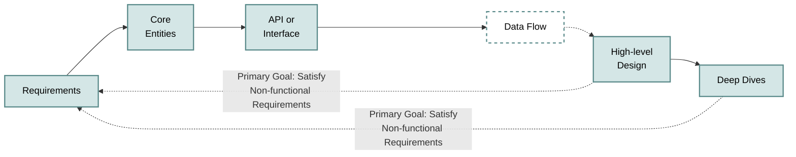

# System Design Interview Fundamentals

## Approach
Following [Hello Interview](https://www.hellointerview.com) approach we have

## 1. Requirements:

### 1.1 Functional Requirements: 
- What is the application suppose to do? For example, user can post a tweet
- user can see all tweets of another user
- Keep it concise (2, 3 things). Ask interviewer if that look reasonable

### 1.2 Non-Functional Requirements:
When defining functional requirements add why is it relevant to the application. 
Remember the CAP theorem, there is always a tradeoff between Consistency and Availability.

- Availability: how much time is the app up a year. Measured in the percentage of up time
    - 99% (two nines): 3.65 days (Moderate reliability)
    - 99.9% (three nines): 8.77 hours (Good uptime)
    - 99.99% (four nines): 52.6 minutes (Very high reliability)
    - 99.999% (five nines): 5.26 minutes (**Highly available (standard)**)
    99.9999% (six nines): 31.56 seconds (Exceptional, very rare)

- Scalability: normally measured in the amount of DAU the system handles. For example, the system should be able to handle 100M DAU
- Consistency: how distributed systems guarantee that multiple copies (replicas) of data remain in sync
    - **strong consistency**: guarantees that every read returns the most recent write across all nodes. Common in financial systems
    - **eventual consistency**: if no new updates are made, all data replicas will eventually agree on the same value. There is some delay before every part of the system displays the updated state. Useful in non-critical apps like social media

- Performance: how efficiently and effectively a system consumes resources to achieve its goals. Measured in:
    - **latency**:The time it takes for a request to travel from the client to the server and back. Normal REST request are ~100 ms. gRPC ~ 10ms. In order to achieve real time request must be >= 500 ms
    - **Throughput**: Throughput: The number of operations, transactions, or requests the system completes within a certain timeframe. For example, Request Per Second (RPS), Queries Per Second (QPS)

The majority of system design interviews focus on this one, however, the following are also valid.  
- **Security**: How secure does the system need to be? Think about authentication vs authorization. Encryption. 
- **Compliance**: Are there legal or regulatory requirements the system needs to meet? Consider industry standards, data protection laws, and other regulations.

## 2. Capacity Estimation
Following approach:
Let's simplify the process:
- **Determine What to Estimate**: Figure out which quantities are load-bearing for your design.
- **Break It Down**: Start with a big problem. Slice it into smaller pieces.
- **Use What You Know**: Apply basic principles and facts you're confident about.
- **Keep It Simple**: Stick to round numbers. Precision isn't the goal; ballpark is.
- **Check Yourself**: Does your answer make sense in the real world?

I will focus on **Use What You Know** and then provide an example

### Storage

| Power of 1000 (1000^x) | Number       | Prefix |
|------------------------|-------------|--------|
| 0                      | Unit        |        |
| 1                      | Thousand    | Kilo   |
| 2                      | Million     | Mega   |
| 3                      | Billion     | Giga   |
| 4                      | Trillion    | Tera   |
| 5                      | Quadrillion | Peta   |

### Latency
| Action                                             | Time   | Comparison      |
|----------------------------------------------------|--------|-----------------|
| Reading 1mb sequentially from memory               | 0.25ms |                 |
| Reading 1mb sequentially from SSD                  | 1ms    | 4x memory       |
| Reading 1mb sequentially from spinning disk        | 20ms   | 20x SSD         |
| Round trip network latency CA to Netherlands  | 150 ms

| Item                                                              | Size  |
|-------------------------------------------------------------------|-------|
| A two-hour movie                                                  | 1 GB  |
| A small book of plain text                                        | 1 MB  |
| A high-resolution photo                                           | 1 MB  |
| A medium-resolution image (or a site layout graphic)             | 100 KB|

### Business
| Metric                                              | Order of Magnitude |
|-----------------------------------------------------|--------------------|
| Daily active users of major social networks        | O(1b)              |
| Hours of video streamed on Netflix per day         | O(100m)            |
| Google searches per second                        | O(100k)            |
| Size of Wikipedia                                 | O(100gb)           |

## 3. Core Entities ( 2 min):
Define the core entities of your system
- Who are the actors in the system? Are they overlapping?
- What are the nouns or resources necessary to satisfy the functional requirements?

## API or System Interface (5 minutes)
Maps to satisfy functional requirements. You should define which API protocol to follow
- REST:  Uses HTTP verbs (GET, POST, PUT, DELETE) to perform CRUD operations on resources. This should be your default choice for most interviews.
- GraphQL: Allows clients to specify exactly what data they want to receive, avoiding over-fetching and under-fetching. Choose this when you have diverse clients with different data needs.
- RPC (Remote Procedure Call): Action-oriented protocol (like gRPC) that's faster than REST for service-to-service communication. Use for internal APIs when performance is critical.

## [Optional] Data Flow (~5 minutes)
For some backend systems, especially data-processing systems, it can be helpful to describe the high level sequence of actions or processes that the system performs on the inputs to produce the desired outputs. If your system doesn't involve a long sequence of actions, skip this!
We usually define the data flow via a simple list. You'll use this flow to inform your high-level design in the next section.
For a web crawler, this might look like:
1. Fetch seed URLs
2. Parse HTML
3. Extract URLs
4. Store data
5. Repeat

## High Level Design (~10-15 minutes)
Diagram to fullfill your functional requirements. One good way to solve this is to follow the API endpoints you have defined.

## Deep Dive (~10 Mins)
Improve the High Level Design by:
- Making sure all non-functional requirements are met
- Addressing edge cases 
- Identifying bottlenecks 
